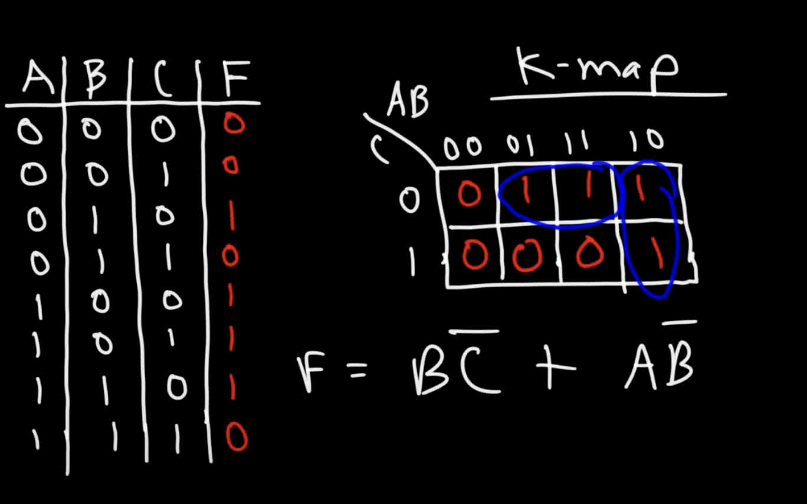

**数字电路模拟器**：时钟、导线、NAND、寄存器是数字系统的基本组成部分：数字系统在时钟驱动下离散地更新下一周期的寄存器状态。

这一小段程序模拟数字电路的执行过程，它也是 [nvboard](https://github.com/NJU-ProjectN/nvboard) 的基本原理。这个例子还展示了 UNIX Philosophy 中命令行工具的协作原理——C 程序 logisim 输出类似 `A=0; B=1; ...` 的数码管状态，而另一个程序负责解析这些输出并真实地 “画” 出来。

**重要知识**：布尔函数最简化的方法——KarnaughMap/K-map

